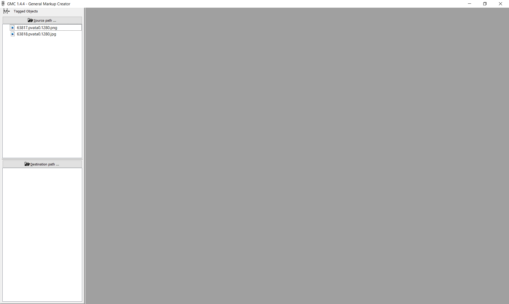
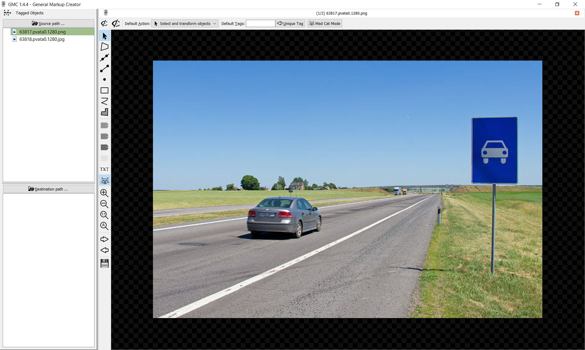
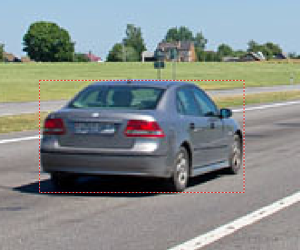

======================
Схема "Tagged Objects"
======================

Схема "Tagged objects" предназначена для разметки произвольных
объектов на изображениях. Для разметки доступны следующие инструменты:

   * Точка; :ref:`add_point`
   * Отрезок; :ref:`add_segment`
   * Прямая; :ref:`add_line`
   * Ломаная линия; :ref:`add_broken_line`
   * Прямоугольник (ректангл); :ref:`add_rectangle`
   * Четырёхугольник произвольной формы (квадрангл); :ref:`add_quadrangle`
   * Замкнутая область произвольной формы (регион). :ref:`add_region`

Главное окно GMC
----------------

   Окно программы после выбора схемы "Tagged Objects", а также датасета
   и директории для разметки.

В левой верхней части экрана отображается список изображений для разметки.
В правой нижней части – область, где будут появляться файлы разметки.
По центру расположена основная рабочая область.

Чтобы приступить к разметке, нужно открыть изображение.
Для этого нужно дважды щёлкнуть левой кнопкой мыши по первому
изображению в списке.

   Окно программы после открытия изображения.

Кроме того, между открытым изображением и списком изображений, а также
над открытым изображением появятся панели с кнопками. В верхней части
панели расположены инструменты разметки. В средней части – кнопки
для задания тегов. В нижней – кнопки навигации по датасету,
масштабирования и сохранения. Для того, чтобы узнать название кнопки,
а также их горячие клавиши, нужно навести на курсор на интересующую кнопку.
Активные кнопки инструменты подсвечены синим.

Навигация по изображениям
-------------------------

Перемещаться между изображениями датасета можно либо двойным щелчком
по интересующей картинке в списке изображений (в этом случае возникнет
диалоговое окно с предложением сохранить изменения, сделанные
на текущем изображении), либо с использованием кнопок
"Next File" - следующее изображение и "Previous File" -- предыдущее
изображение. Причём, при переходе с использованием этих клавиш,
изменения будут сохранятся автоматически, а в директории
с разметкой появляться файлы разметки. На практике для перехода
между кадрами наиболее удобно пользоваться горячие клавишами
клавиатуры:

   * :kbd:`Space`, :kbd:`N` или :kbd:`Page Down`
     для перехода к следующему изображению;
   * :kbd:`Backspace`, :kbd:`P` или :kbd:`Page Up`
     для перехода к предыдущему изображению.

Масштабирование
---------------

Кроме того, изображение можно масштабировать с помощью кнопок
"Zoom In", "Zoom Out" и "Zoom 1:1". На практике наиболее удобно
производить масштабирование с помощью колёсика мыши при зажатой на
клавиатуре клавише :kbd:`Ctrl`. Если активна кнопка "Auto Zoom"
(подсвечена синим), то при переходе на следующее изображение
картинка будет автоматически масштабироваться по размеру экрана.

Сохранение
----------

Клавиша "Save" и сочетание клавиш :kbd:`Ctrl-S` отвечают
за сохранение произведённых изменений.

Использование инструментов разметки
-----------------------------------

Select and Transform Objects
~~~~~~~~~~~~~~~~~~~~~~~~~~~~

Данный инструмент используется для выделения разметки на открытом изображении.
Границы выделенной разметки имеют синий цвет. Невыделенной – красный.

.. _add_quadrangle:

Add Quadrangle
~~~~~~~~~~~~~~

Четырёхугольник. Служит для разметки четырёхугольника произвольной формы.
Для того чтобы воспользоваться этим инструментом нужно убедиться, что этот
инструмент активен. Затем навести курсор на изображение в место, где
предполагается левый верхний угол четырёхугольника.
Зажать левую кнопку мыши и, не отпуская кнопку, "протянуть" курсор
до предполагаемого правого нижнего угла четырёхугольника затем отпустить
ЛКМ :numref:`quadrangle_create`

   Четырёхугольник после его создания.

Теперь требуется "подтянуть" вершины четырёхугольника на свои места.
Убедившись, что прямоугольник выделен (его границы синего цвета) делаем
двойной щелчок ЛКМ по границе прямоугольника, либо нажимаем одну
из цифровых клавиш на дополнительной цифровой клавиатуре
(при включенном Num Lock). Прямоугольник перейдёт в режим редактирования
и будет иметь следующий вид :numref:`quadrangle_edit`

   Четырёхугольник в режиме редактирования.

Если переход в режим редактирования был произведён двойным щелчком
по границе прямоугольника либо нажатием клавиши "5", то все четыре вершины
будут активны (закрашены). Если же переход в режим редактирования был
осуществлён нажатием на какую-либо другую цифру клавиатуры, то активными
будут лишь часть вершин. Возможны следующие варианты:

   * :kbd:`1` - левая верхняя вершина;
   * :kbd:`2` - две нижние вершины;
   * :kbd:`3` - правая нижняя вершина;
   * :kbd:`4` - две левые вершины;
   * :kbd:`6` - две правые вершины;
   * :kbd:`7` - левая верхняя вершина;
   * :kbd:`8` - две верхние вершины;
   * :kbd:`9` - правая верхняя вершина.

Остальные вершины будут неактивными.
Пример перехода в режим редактирования нажатием клавиши :kbd:`7`
изображен на :numref:`quadrangle_edit_point`.

   Редактирование после нажатия клавиши :kbd:`7`.

В режиме редактирования активные точки можно двигать в нужном направлении
с помощью клавиш стрелок на клавиатуре: при одном нажатии вершина будет смещаться на один пиксель в соотвествующую сторону. Если при этом зажимать клавишу :kbd:`Shift`, то вершина будет смещаться на сразу на 5 пикселей. При зажатии клавиши :kbd:`Ctrl` - смещение будет происходить на четверть пикселя.
Активные точки можно менять, кликая на них ЛКМ либо нажимаю соответствующую
их положению кнопку на цифровой клавиатуре.
Когда все вершины будут находится на своих местах нужно будет выйти
из режима редактирования.
Для этого производится двойной щелчок ЛКМ по произвольному свободному
от разметки месту изображения. Итоговый результат разметки
с использованием инструмента "Add Quadrangle" показан
на :numref:`quadrangle_complete`.

   Готовая разметка

.. _add_line:

Add Line
~~~~~~~~

Прямая линия.
Служит для разметки прямых линий на изображении.
Как известно, прямая задаётся двумя точками.
Прежде всего нужно убедиться, что инструмент активен.
Далее курсор наводится на место первой точки и зажимается ЛКМ.
Не отпуская кнопку протягиваем курсор до места второй точки прямой
и отпускаем ЛКМ.
Таким образом будет размечена прямая, проходящая через две точки.
Пример такой прямой изображён на :numref:`line_create`.

   Прямая линия после добавления

Корректировку положения прямой можно производить, перейдя
в режим редактирования.
Для этого нужно дважды щёлкнуть ЛКМ по прямой или с помощью инструмента
Select and Transform Objects выделить прямую (она станет синего цвета)
и нажать любую цифру на дополнительной цифровой клавиатуре
(при включенном Num Lock).
После перехода в режим редактирования прямая примет
следующий вид :numref:`line_edit`.

   Режим редактирования прямой линии

.. _add_segment:

Add Segment
~~~~~~~~~~~

Аналогичным образом, с помощью инструмента
**Add Segment** можно разметить отрезок.
Он задаётся и редактируется аналогично прямой.

.. _add_point:

Add point
~~~~~~~~~

Служит для разметки точечных объектов на изображении.
Чтобы разметить точку нужно выбрать данный инструмент
и щелкнуть на изображении в нужном месте.
Положение точки корректируется аналогично положению
точек, которыми заданы прямые и отрезки.

.. _add_rectangle:

Add Rectangle
~~~~~~~~~~~~~

Прямоугольник.
Задаётся, а положение его вершин редактируется аналогично **Add Quadrangle**.
Данный инструмент используется для разметки большинства
объектов по схеме "Tagged Objects".

.. _add_broken_line:

Add Broken Line
~~~~~~~~~~~~~~~

Ломаная линия.
Используется, когда необходимо разметить ломаную линию.
Разметка производится путём последовательных щелчков по местоположениям
вершин размечаемой ломаной линии.
Корректировка положения вершин и их удаление производится аналогично тому,
как и в других инструментах.
Для этого нужно выполнить следующую последовательность действий:

   1. Перейти в режим **Select and Transform Objects**;
   2. Сделать двойной щелчок по ломаной линии.
      На ней появятся вершины (в виде выколотых точек);
   3. Щёлкнуть ЛКМ по нужной вершине. Вершина станет розового цвета;
   4. Теперь можно либо удалить эту вершину (кнопка :kbd:`Del`)
      либо скорректировать её положение с помощью стрелок на клавиатуре
      либо перетаскивая её мышью при нажатой ЛКМ.

.. _add_region:

Add Region
~~~~~~~~~~

Регион.
Данный инструмент используется, когда нужно разметить область,
ограниченную многоугольником произвольной формы.
Для этого нужно выбрать инструмент "Add Region" и последовательно
щёлкнуть ЛКМ по предполагаемому расположению вершин многоугольника,
ограничивающего область.
Для завершения разметки на месте последней вершины нужно
сделать двойной щелчок.
Пример размеченного региона изображен на :numref:`region_edit`.

   Режим редактирования многоугольника

Корректировка положения нескольких объектов
-------------------------------------------

В GMC имеется возможность корректировки положения нескольких
объектов одновременно.
Для этого необходимо с помощью инструмента **Select and Transform Objects**
выделить область с интересующими объектами.
Они перейдут в выделенное состояние (станут синими).
Теперь с помощью стрелок на клавиатуре можно корректировать
их положение.
Чтобы снять выделенное состояние объектов достаточно щёлкнуть
ЛКМ по свободной от разметки части изображения.
